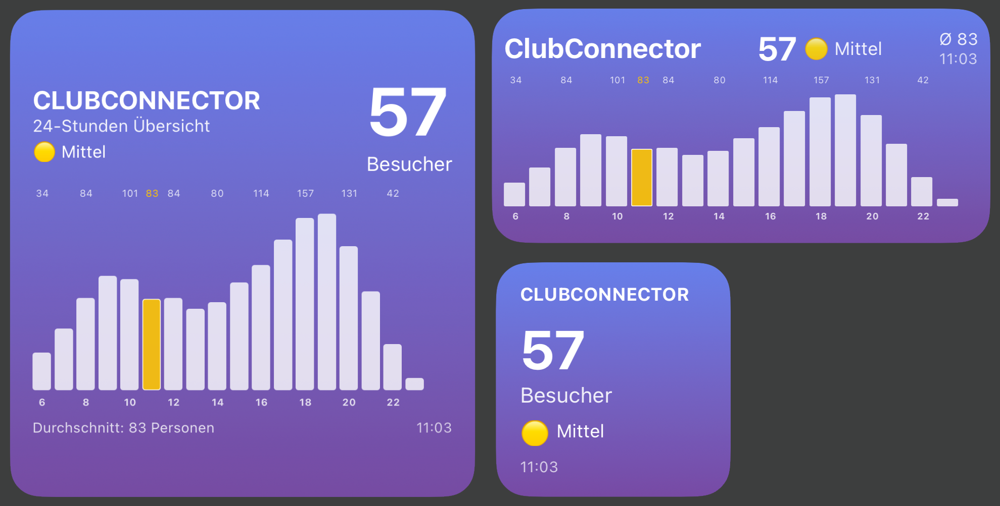

# ClubConnector Scriptable Widget

Ein iOS Widget für [Scriptable](https://scriptable.app), das die aktuelle Auslastung deines Fitnessstudios anzeigt, welches die ClubConnector App verwendet.

## 📱 Features

- **Live-Auslastung**: Zeigt die aktuelle Besucherzahl in deinem Gym
- **Visuelle Darstellung**: Farbcodierte Balkendiagramme für erwartete Auslastung über den Tag (6:00 - 24:00)
- **Drei Widget-Größen**: Klein, Mittel und Groß
- **Status-Indikator**: Grün/Gelb/Rot je nach Auslastung

## 📸 Screenshots




## ⚡ Voraussetzungen

- iPhone/iPad mit iOS 14+
- [Scriptable App](https://apps.apple.com/de/app/scriptable/id1405459188) (kostenlos)
- ClubConnector App deines Fitnessstudios
- Die ClubConnector App muss den Bereich "Was ist los in meinem Club" unterstützen

## 🚀 Installation

### 1. API-Konfiguration deines Gyms ermitteln

Da die ClubConnector API nicht öffentlich dokumentiert ist, musst du die Zugangsdaten über einen HTTPS-Proxy ermitteln. **Wichtig**: Jedes Gym hat unterschiedliche API-URLs und Zugangsdaten.

#### Methode 1: Proxyman (iOS App)

1. Installiere [Proxyman](https://apps.apple.com/de/app/proxyman/id1551292695) auf deinem iPhone
2. Folge den Anweisungen in Proxyman, um ein Root-Zertifikat zu installieren und HTTPS-Traffic zu entschlüsseln
3. Starte Proxyman und aktiviere die Aufzeichnung
4. Öffne die ClubConnector App
5. Navigiere zur Auslastungs-Ansicht (z.B. **"Was ist los in meinem Club"**)
6. In Proxyman, suche nach Requests zu `*.sovd.cloud/api/app/content/Capacity`
7. Tippe auf den Request und schaue in die Headers
8. Notiere dir folgende Werte:
   - **URL**: Die komplette URL (z.B. `https://fl02-mcc.sovd.cloud/api/app/content/Capacity`)
   - **Authorization**: Der Bearer Token (beginnt mit "Bearer eyJ...")
   - **x-app-id**: Die App-ID
   - **x-device-id**: Deine Device-ID
   - **x-standort-id**: Die Standort-ID deines Gyms

#### Methode 2: Proxy am Computer

Verwende eine Proxy-Software (z.B. Charles Proxy, mitmproxy, Fiddler) auf deinem Computer, um den iPhone-Traffic zu loggen. Konfiguriere dein iPhone, um den Proxy zu nutzen, und ermittle die gleichen Werte wie oben beschrieben.

### 2. Script installieren

1. Öffne die Scriptable App
2. Tippe auf das **+** Symbol um ein neues Script zu erstellen
3. Kopiere den kompletten Code aus [`clubconnector-widget.js`](clubconnector-widget.js)
4. Füge den Code in Scriptable ein
5. Benenne das Script (z.B. "ClubConnector Widget")

### 3. Widget konfigurieren

Öffne das Script in Scriptable und passe die Konfiguration am Anfang der Datei an:

```javascript
const CONFIG = {
  // Dein Gym-Name
  clubName: "Mein Gym",

  // API Konfiguration
  api: {
    url: "https://[DEINE-SUBDOMAIN].sovd.cloud/api/app/content/Capacity",
    bearerToken: "Bearer [DEIN-TOKEN]",
    appId: "[DEINE-APP-ID]",
    deviceId: "[DEINE-DEVICE-ID]",
    standortId: "[DEINE-STANDORT-ID]",
    // Diese Werte kannst du meist so lassen:
    appVersion: "2.0.1",
    platform: "iOS"
  },

  // Optional: Schwellenwerte anpassen
  thresholds: {
    low: 40,     // Niedrige Auslastung unter 40 Besucher
    medium: 90   // Mittlere Auslastung unter 90 Besucher
  }
};
```

### 4. Widget zum Home Screen hinzufügen

1. Lange auf den Home Screen drücken bis die Apps wackeln
2. Tippe auf **+** in der oberen Ecke
3. Suche nach **Scriptable**
4. Wähle die gewünschte Widget-Größe
5. Füge das Widget hinzu
6. Bearbeite das Widget (lange drücken und "Widget bearbeiten" wählen)
7. Wähle dein Script (z.B. "ClubConnector Widget") aus

## 🎨 Anpassungen

### Farben ändern

```javascript
colors: {
  gradientStart: "#667eea",  // Obere Gradient-Farbe
  gradientEnd: "#764ba2",    // Untere Gradient-Farbe
  currentHourBar: "#FEC503", // Farbe für aktuelle Stunde
  normalBar: "#ffffff"       // Farbe für normale Balken
}
```

### Schwellenwerte anpassen

Die Schwellenwerte bestimmen, wann das Widget grün/gelb/rot anzeigt:

```javascript
thresholds: {
  low: 30,     // Anpassen an dein Gym
  medium: 70   // Anpassen an dein Gym
}
```

### Texte ändern

Alle Texte können in der Konfiguration angepasst werden:

```javascript
labels: {
  visitors: "Besucher",
  average: "Durchschnitt",
  // ... weitere Texte
}
```

## 📝 Lizenz

MIT License - siehe [LICENSE](LICENSE) Datei

## 🤝 Contributing

Pull Requests sind willkommen! Für größere Änderungen, bitte erst ein Issue öffnen.